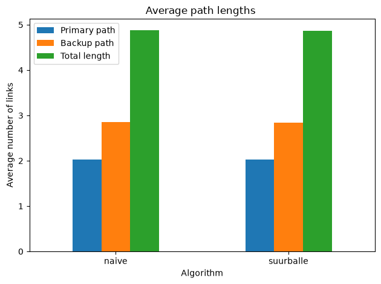
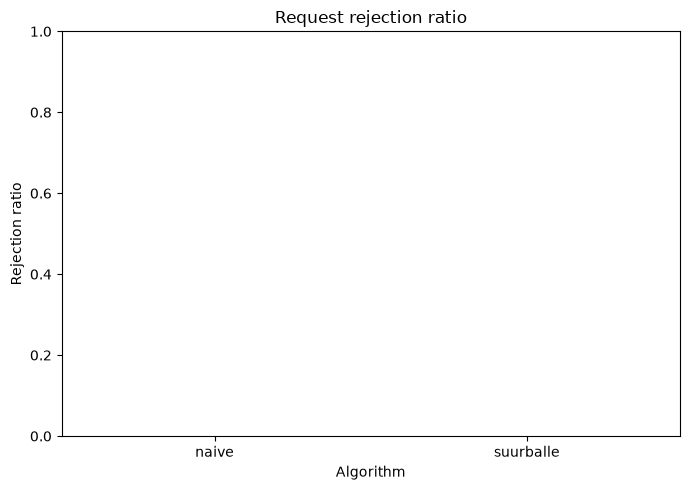
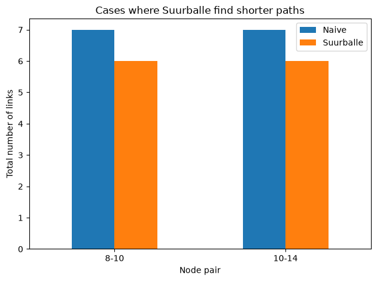

# NSS Disjoint Paths: Naive vs Suurballe

This project compares two approaches for finding two link-disjoint paths in a network topology:

* a naive sequential approach based on Dijkstra's algorithm,
* Suurballe's algorithm.

The project was prepared for the **Niezawodność systemów sieciowych** course and focuses on evaluating the efficiency of both algorithms for `k = 2`, which means one primary path and one backup path.

## Project goal

The main goal is to compare both algorithms in terms of:

* average number of links in the primary path,
* average number of links in the backup path,
* average total number of links,
* request rejection ratio.

The analyzed network is represented as an undirected graph. Nodes represent network devices, while edges represent transmission links.

## Network topology

The project uses the assigned C4 topology consisting of:

* 16 nodes,
* 28 links.

The topology is stored in:

```text
data/topology_c4_edges.csv
```

Each link has weight equal to `1`, because path length is interpreted as the number of links.

## Project structure

```text
nss-disjoint-paths-suurballe/
│
├── data/
│   └── topology_c4_edges.csv
│
├── results/
│   ├── raw_results.csv
│   ├── summary_results.csv
│   ├── comparison_results.csv
│   └── figures/
│       ├── topology_c4.png
│       ├── average_lengths.png
│       ├── rejection_ratio.png
│       └── suurballe_better_cases.png
│
├── src/
│   ├── topology.py
│   ├── naive.py
│   ├── suurballe.py
│   ├── experiments.py
│   ├── analyze_results.py
│   └── visualization.py
│
├── requirements.txt
├── .gitignore
└── README.md
```

## Installation

Create and activate a virtual environment:

```bash
python -m venv .venv
```

Activate it on Windows:

```bash
.venv\Scripts\activate
```

Install dependencies:

```bash
pip install -r requirements.txt
```

## Usage

### 1. Display topology information and generate topology figure

```bash
python src/topology.py
```

This script loads the C4 topology, prints basic graph information and saves the topology visualization to:

```text
results/figures/topology_c4.png
```

### 2. Test the naive algorithm

```bash
python src/naive.py
```

The naive approach works as follows:

1. Find the shortest primary path using Dijkstra's algorithm.
2. Remove all links used by the primary path.
3. Find the shortest backup path in the modified graph.

### 3. Test Suurballe's algorithm

```bash
python src/suurballe.py
```

Suurballe's algorithm is used to find a pair of link-disjoint paths more efficiently than the simple sequential approach.

### 4. Run full experiments

```bash
python src/experiments.py
```

The experiment checks all unordered pairs of nodes in the topology.

For 16 nodes, this gives:

```text
16 * 15 / 2 = 120 requests
```

The script generates:

```text
results/raw_results.csv
results/summary_results.csv
```

### 5. Analyze differences between algorithms

```bash
python src/analyze_results.py
```

This script compares the results of both algorithms for every source-target pair and generates:

```text
results/comparison_results.csv
```

### 6. Generate charts

```bash
python src/visualization.py
```

The generated figures are saved in:

```text
results/figures/
```

## Current results

For the C4 topology, both algorithms successfully handled all 120 requests.

| Algorithm | Total requests | Accepted | Rejected | Rejection ratio | Avg. primary length | Avg. backup length | Avg. total length |
| --------- | -------------: | -------: | -------: | --------------: | ------------------: | -----------------: | ----------------: |
| naive     |            120 |      120 |        0 |             0.0 |               2.025 |           2.858333 |          4.883333 |
| suurballe |            120 |      120 |        0 |             0.0 |               2.025 |           2.841667 |          4.866667 |

Suurballe's algorithm achieved a slightly lower average total path length.

In two cases, Suurballe found a shorter total pair of link-disjoint paths:

| Source | Target | Naive total length | Suurballe total length |
| -----: | -----: | -----------------: | ---------------------: |
|      8 |     10 |                  7 |                      6 |
|     10 |     14 |                  7 |                      6 |

## Generated figures








## Technologies

* Python
* NetworkX
* pandas
* matplotlib
